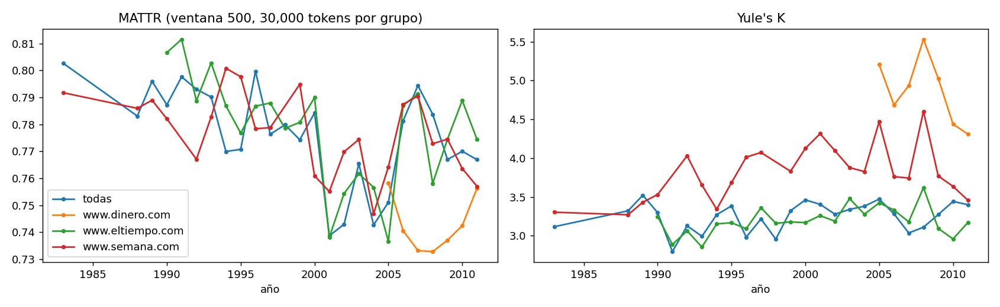
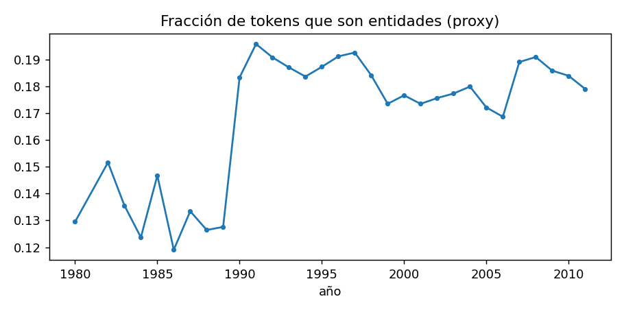
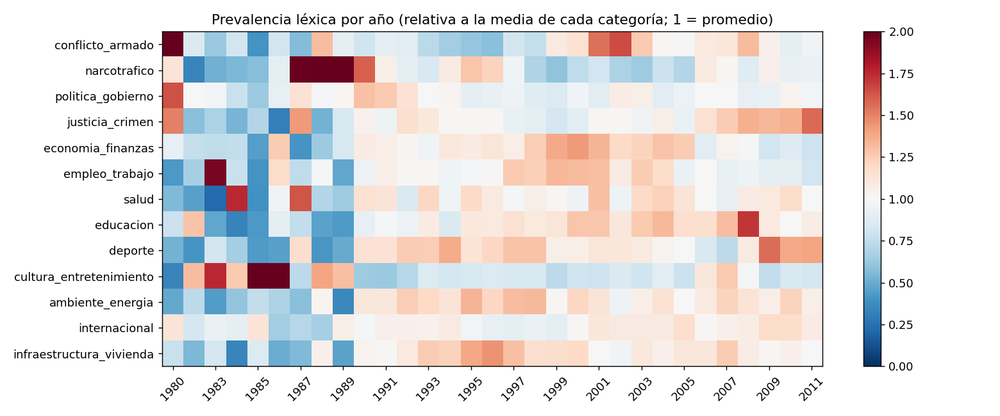
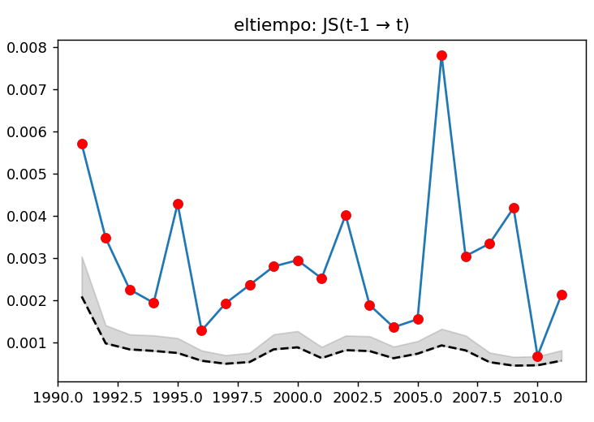
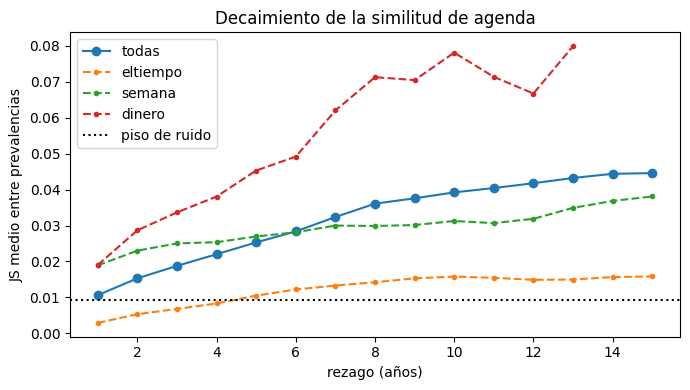
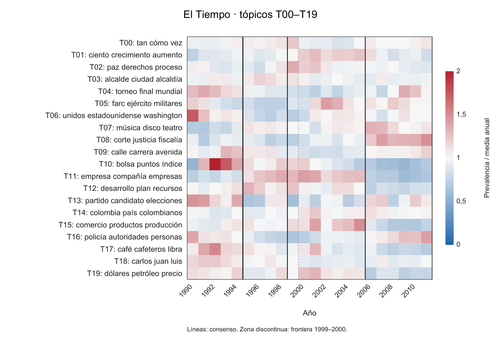
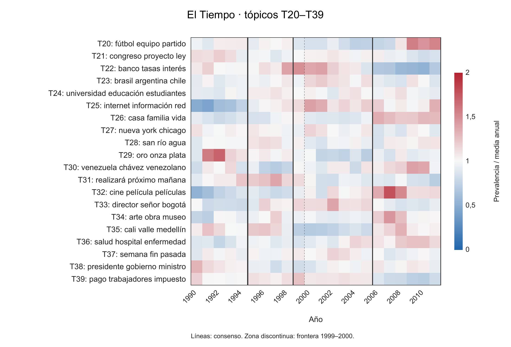

# Entrega 2 · Estabilidad de la agenda temática de la prensa colombiana (1980–2011)

**Integrantes:** José Miguel Bejarano, Massimo Maimone, Mauricio Morales, Juan Felipe Guzmán y David Castañeda.

**Curso:** Procesamiento de Lenguaje Natural · Pontificia Universidad Javeriana. **Profesor:** Luis Gabriel Moreno Sandoval. **Fecha:** 5 de octubre de 2026.

## 1. Resumen y pregunta de investigación

La agenda temática de los documentos de El Tiempo entre 1990 y 2011 presenta diferencias anuales pequeñas, aunque estadísticamente detectables, y tres fronteras de segmentación reproducidas por las variantes examinadas: 1995, 1999–2000 y 2006. El cambio medio entre años consecutivos, medido con divergencia Jensen–Shannon (JS), es 0,00293; equivale aproximadamente al 5,90% de la distancia media entre El Tiempo y Semana en el mismo año (0,04970). Estas magnitudes describen el corpus disponible y dependen de la representación y del modelo de tópicos.

La pregunta es: **¿qué tópicos latentes caracterizan los documentos de El Tiempo, Semana y Dinero entre 1980 y 2011, qué diferencias existen entre fuentes y qué estabilidad o cambios muestra su composición temática?** Se define agenda como la media anual de las composiciones de tópicos de los documentos. Esta definición mide contenido publicado y conservado en el corpus; no mide la opinión pública, la audiencia ni la importancia social de cada asunto.

El análisis usa 91.585 documentos, con 31.896.684 tokens alfabéticos antes del filtro y 15.532.463 tokens de contenido. El Tiempo aporta el 89,03% de los documentos. Antes de 1990 solo hay Semana y falta 1981; por tanto, la serie principal de inferencia es El Tiempo, 1990–2011. El corpus completo se conserva para descripción y contraste.

La metodología realizada combina EDA avanzado, TF-IDF, factorización de matrices no negativas (NMF), prevalencias anuales, JS frente a un nulo por permutación, corrección Benjamini–Hochberg y segmentación binaria calibrada. En El Tiempo, las 21 de 21 transiciones anuales evaluadas son significativas, con magnitud media pequeña. La segmentación principal produce tres cortes, que dividen la serie en cuatro regímenes. Su robustez se examina con seis variantes dependientes del mismo corpus y familia de modelo.

El contraste histórico encuentra tres coincidencias de tres fronteras con una lista de eventos a ±1 año, pero una referencia aleatoria obtiene 2,53 coincidencias en promedio y p = 0,581. No hay evidencia de coincidencia superior a esa referencia ni fundamento para atribuir causalidad histórica. Se propone ampliar la evaluación mediante NMF, LDA, BERTopic y STM, junto con auditoría de cobertura, validación humana, bootstrap y protocolos sin fuga de información. Esas comparaciones y controles son trabajo futuro.

## 2. Estado del arte y fundamento conceptual

El proyecto relaciona la medición cuantitativa del texto con modelos de tópicos y análisis temporal. La tradición de frecuencias permite construir indicadores a partir de grandes colecciones, pero exige distinguir el registro mediático de la realidad social que se pretende estudiar. Caicedo, Gaviria y Moreno (2012), en *Hechos y palabras*, estudian más de dos millones de artículos y alrededor de seiscientos millones de palabras. El dataset aquí disponible pertenece al mismo ámbito de medios colombianos, aunque no se ha trazado artículo por artículo como subconjunto de ese estudio ni constituye una muestra probabilística representativa.

| Línea | Referencias y aporte | Aplicación en esta entrega |
| --- | --- | --- |
| Frecuencia de palabras y culturomics | Michel et al. (2011); Caicedo, Gaviria y Moreno (2012). Lectura cuantitativa de colecciones y series de frecuencia | Normalización por cantidad de texto; contextualización del corpus y cautela frente al sesgo mediático |
| Agenda y cambio | McCombs y Shaw (1972); Baumgartner y Jones (1993); Comparative Agendas Project (CAP) | Marco para formular estabilidad y cambio; no se comprueba una teoría de agenda pública mediante la segmentación del corpus |
| Modelos de tópicos | Lee y Seung (1999), NMF; Blei, Ng y Jordan (2003), LDA; modelos dinámicos, STM y BERTopic | NMF como base realizada; LDA, BERTopic y STM como alternativas futuras |
| Representación | TF-IDF; Reimers y Gurevych (2019), Sentence-BERT | Contraste exploratorio de representaciones dispersas y densas, limitado a tareas de clasificación de fuente y periodo |
| Análisis de cambios | Ráfagas de Kleinberg; segmentación temporal y PELT | Antecedente exploratorio de ráfagas; segmentación binaria actual; PELT como alternativa pendiente |
| Estadística textual | Log-odds regularizado, NPMI y MATTR | Descripción de vocabulario distintivo, asociaciones y diversidad; separación entre cálculo válido y defectuoso |

NMF representa cada documento como combinación aditiva de componentes con pesos no negativos. Permite leer cada componente mediante sus palabras principales y usarlo como unidad de análisis temporal. LDA ofrece una formulación probabilística de mezclas de tópicos. Los embeddings representan texto en un espacio denso y permiten explorar agrupaciones semánticas, aunque su desempeño depende del modelo, del dominio y del truncamiento. STM resulta pertinente para estudiar covariables de fuente y tiempo, sin que su uso por sí solo identifique efectos causales.

El aporte específico es pasar de frecuencias de términos a composiciones documentales y comparar sus distancias con una referencia de muestreo. La hipótesis conceptual de estabilidad con cambios orienta las preguntas; encontrar cortes en una serie no demuestra equilibrio puntuado ni establece que la población cambió sus preocupaciones.

## 3. Ajustes respecto a la Entrega 1 y razones de los cambios

La Entrega 1 y la propuesta inicial describieron el corpus, sus problemas de limpieza y la necesidad de caracterizar temas sin anotación manual completa. Los notebooks exploratorios 03 y 04 son antecedentes posteriores de la evolución metodológica. La Entrega 2, sustentada en las salidas guardadas de 05 y 06, incorpora medición documental, representaciones y un modelo explícito de tópicos.

| Problema o decisión anterior | Razón para ajustar | Decisión actual y alcance |
| --- | --- | --- |
| Cifras resumidas como 32,8 millones de palabras | Se mezclaban conteos previos y definiciones de token | Reportar 31.896.684 tokens antes del filtro y 15.532.463 de contenido, cada uno con su definición |
| Regla de candidato si dos de tres señales estaban en su cuartil superior | Un umbral relativo puede marcar candidatos sin calibrar la ausencia de cambio; la combinación no garantiza exactamente 25% | Sustituir por referencias de permutación y reportar magnitud junto a significación |
| Bienios en los años 80 y trimestres desde 1990 | Los periodos tenían duraciones y tamaños distintos | Usar resolución anual homogénea y restringir comparaciones a años con N ≥ 40 |
| Divergencias sin referencia de muestreo | Una muestra pequeña puede producir distancia aun sin cambio sistemático | Construir el nulo al mismo tamaño de los dos grupos, estratificado por fuente |
| Vocabulario dominado por nombres propios | Aparición de personas puede confundirse con variación temática | Medir entidades proxy y examinar una variante sin palabras asociadas a entidades |
| Interpretar una serie combinada como una sola agenda | La composición de fuentes cambia con el año | Dar prioridad a El Tiempo y distinguir series por fuente, combinada y estandarizada |
| Comparar solo vocabulario o ráfagas de términos | Las señales no resumían mezclas temáticas documentales | Mantener TF-IDF como entrada y añadir NMF, θ y prevalencia anual |
| Presentar un léxico como categorización externa validada | Es un recurso construido para el proyecto, sin gold standard | Usarlo como etiqueta débil y descriptor, inspirado en CAP/EuroVoc |

Se mantiene el interés por la interpretación de tópicos, el contraste editorial y la evolución temporal. La cobertura efectiva de El Tiempo comienza en 1990, de modo que el intervalo principal se fija en 1990–2011. La normalización conserva el vínculo entre documento, fuente y fecha; la hora no se usa para inferir rutinas de publicación. La propuesta de modelado se acompaña de límites de cobertura y de validación que impiden confundir documentos archivados con la totalidad de los periódicos.

## 4. Del experimento exploratorio al diseño actual

Los análisis previos de agenda y divergencia léxica sirvieron para identificar decisiones que requerían control. En el experimento exploratorio se combinaron distribuciones de términos frecuentes, promedios TF-IDF y ráfagas de palabras. También se mezclaban resoluciones temporales para compensar la escasez de los años 80. Su función fue diagnóstica: mostró sensibilidad al volumen, a nombres propios y al calendario elegido.

| Señal exploratoria | Qué medía | Aprendizaje utilizado |
| --- | --- | --- |
| JS sobre términos frecuentes | Diferencia de distribuciones léxicas entre periodos | La distancia necesita una referencia de muestreo y una composición de fuentes controlada |
| Distancia coseno entre promedios TF-IDF | Cambio en vocabulario ponderado | Un término distintivo puede ser una persona, una sección o una marca de formato |
| Ráfagas de términos | Concentración temporal de palabras seleccionadas | La elección de términos y de intervalos condiciona la señal |
| Regla combinada de cuartiles | Candidatos definidos por rangos relativos | Requiere calibración nula; no basta con acumular señales altas |

Estas observaciones llevan a una cadena con unidades explícitas: documento → vector de términos → composición de tópicos → agenda anual → distancia y segmentación. La fuente acompaña cada paso. El análisis histórico se reserva para después de la detección, evitando definir fronteras a partir de una narrativa histórica deseada.

El EDA anterior había advertido vocabulario amplio y posibles casi duplicados. Las cifras de esos ejercicios usan preprocesamientos anteriores y no sustituyen los conteos actuales de 05. La deduplicación exacta del corpus medido tampoco garantiza eliminación de artículos casi iguales; esa dependencia sigue siendo una limitación y una tarea de validación futura.

## 5. Corpus, preprocesamiento y alcance

El corpus medido contiene 91.585 documentos con fechas válidas entre 1980 y 2011 y deduplicación por texto normalizado. Su cobertura está desequilibrada tanto por fuente como por año.

| Fuente | Documentos | Porcentaje del corpus | Cobertura y observación |
| --- | --- | --- | --- |
| El Tiempo | 81.539 | 89,03% | 1990–2011; serie principal continua |
| Semana | 6.620 | 7,23% | 1980–2011, sin 1981; única fuente antes de 1990 |
| Dinero | 3.426 | 3,74% | 1993–2011, sin 1996; cobertura escasa en parte del intervalo |
| Total | 91.585 | 100% | 31 años con datos; no es un censo de prensa colombiana |

Fuente: notebook 05, celda 7 y dataset medido. Los porcentajes tienen como denominador 91.585 documentos. El umbral de 40 documentos utilizado por 06 excluye años de una serie particular, sin retirar esos documentos del dataset completo.

La normalización reconstruye cifras y horas separadas, elimina caracteres de control y mantiene las mayúsculas necesarias para el proxy de entidades. La tokenización extrae secuencias alfabéticas con letras acentuadas y ñ; los números y la puntuación quedan fuera de los tokens usados en las representaciones. Los tokens de contenido se convierten a minúsculas, excluyen stopwords en español y términos de la lista periodística utilizada, y tienen longitud mínima de tres caracteres. No se aplica lematización.

| Medida | Valor | Unidad o denominador |
| --- | --- | --- |
| Tokens alfabéticos antes del filtro de contenido | 31.896.684 | Ocurrencias, incluidas stopwords |
| Tokens de contenido | 15.532.463 | Ocurrencias después de filtros |
| Tipos de contenido | 266.562 | Formas distintas del vocabulario filtrado |
| Hapax | 42,34% | Tipos con una aparición / 266.562 tipos |
| Mediana de palabras por documento | 245 | Tokens antes del filtro de contenido |
| Mediana de tokens de contenido | 122 | Documento |
| Media de tokens de contenido | 169,596 | Documento |

Fuente: notebook 05, celdas 10–11. La proporción de hapax es de tipos, no de tokens. El vocabulario sin lematización conserva variantes flexivas, nombres, grafías y ruido; una forma distinta no equivale necesariamente a un concepto nuevo.

El corpus representa lo conservado en el archivo disponible. Sin metadatos completos de sección, edición, formato y procedimiento de extracción, una caída de volumen o un cambio de composición puede reflejar cobertura del archivo. El Tiempo es la serie principal por continuidad y tamaño, no porque represente toda la agenda nacional. Las fechas permiten agregar por año; la hora no tiene interpretación editorial en este análisis.

## 6. EDA avanzado: diversidad, vocabulario y medidas temáticas

### 6.1 Diversidad léxica con tamaño comparable

La razón tipos/tokens (TTR) es sensible a la longitud. Para comparar año y fuente, 05 usa una muestra fija de 30.000 tokens de contenido por grupo y omite los grupos que no alcanzan ese tamaño. Se obtienen 77 grupos: 25 de todas las fuentes, 22 de El Tiempo, 23 de Semana y siete de Dinero. Cada grupo tiene una muestra; no se estiman intervalos de incertidumbre.

MATTR promedia la TTR de ventanas móviles de 500 tokens. Valores mayores indican más formas distintas en una ventana de igual tamaño. Yule K resume concentración en formas repetidas: K = 10⁴ × (Σ m²Vₘ − N) / N², donde Vₘ es el número de tipos con frecuencia m y N es el total de tokens. Mayor K indica más concentración.

**Figura 1.** MATTR y Yule K, notebook 05, celda 13; `diversidad_lexica.csv`. Cada punto usa 30.000 tokens de contenido; MATTR tiene ventana 500. Los grupos insuficientes no aparecen. Las líneas conectan los puntos disponibles y no representan observaciones en los años ausentes. No se muestran intervalos de confianza.

La figura presenta oscilaciones de MATTR y diferencias de concentración entre medios. En los años disponibles, Dinero muestra Yule K relativamente alto y MATTR relativamente bajo, compatible con un vocabulario más concentrado en esta muestra. Las caídas de diversidad alrededor de comienzos de los 2000 son descriptivas; no permiten decidir si cambió el estilo, la mezcla de secciones o la extracción del archivo. Igualar tokens reduce un sesgo de tamaño, pero no controla todas esas diferencias.

La ley de Heaps se ajusta como V = k × N^β, relacionando tipos y tokens acumulados en documentos ordenados aleatoriamente. Los exponentes son aproximadamente 0,460 para el conjunto, 0,460 para El Tiempo, 0,498 para Semana y 0,508 para Dinero (05, celda 14). Describen crecimiento sublineal del vocabulario en el rango observado. No demuestran que este crezca indefinidamente ni que no pueda saturarse fuera de la muestra.

### 6.2 Bigramas y trigramas: conteos y defecto del cálculo NPMI

Se examinaron 12.205 pares candidatos con al menos 30 apariciones y se exportaron 2.000 filas. La NPMI teórica de un par es ln[p(a,b)/(p(a)p(b))] / [−ln p(a,b)], con probabilidades compatibles y rango de −1 a 1. En 05, la probabilidad conjunta usa el total de pares elegibles y las marginales usan el total de tokens de contenido. Esa mezcla de espacios muestrales produce 383 de 2.000 puntuaciones mayores que 1, con máximo 1,2549. Por ello, **el ranking exportado no se interpreta como asociación NPMI válida**.

Los conteos observados siguen siendo útiles como ejemplos, con la advertencia de que su selección se hizo mediante el cálculo defectuoso.

| Expresión | Ocurrencias observadas | Interpretación permitida |
| --- | --- | --- |
| derechos humanos | 3.574 | Conteo de pares adyacentes elegibles |
| américa latina | 3.768 | Conteo de pares adyacentes elegibles |
| wall street | 857 | Conteo de pares adyacentes elegibles |
| juan manuel santos | 1.292 | Conteo de trigrama entre candidatos seleccionados |
| producto interno bruto | 534 | Conteo de trigrama entre candidatos seleccionados |

Fuente: notebook 05, celda 16. Son ocurrencias, no número de documentos ni puntuaciones de asociación. La eliminación de puntuación puede permitir pares que cruzan límites de oración. Los trigramas dependen de pares seleccionados con el umbral NPMI defectuoso. No se comparan épocas mediante estas cuentas sin normalizar ni se incorporan esos bigramas al modelo NMF actual.

### 6.3 Términos distintivos mediante log-odds

El log-odds con prior de Dirichlet compara la frecuencia de una palabra en un grupo con su frecuencia en el resto, regularizando términos poco frecuentes con información del corpus. En forma resumida, δ̂w = ln[(yAw + αw)/(nA + α₀ − yAw − αw)] − ln[(yBw + αw)/(nB + α₀ − yBw − αw)]; el estadístico z divide δ̂w por su error estimado. Un z mayor identifica una diferencia regularizada, no la relevancia social de una palabra.

| Comparación | Ejemplos persistidos de términos distintivos |
| --- | --- |
| 1980–1989 frente al resto | reagan, norteamericano, betancur, barco, soviéticos |
| 1990–1999 frente al resto | samper, ernesto, clinton, gaviria, constituyente |
| 2000–2011 frente al resto | uribe, farc, chávez, santos, internet, paramilitares |
| El Tiempo frente al resto | calle, municipio, alcalde, cali, barrio |
| Semana frente al resto | guerra, farc, uribe, paramilitares, política |
| Dinero frente al resto | crecimiento, empresas, mercado, exportaciones, inversión |

Fuente: notebook 05, celda 19. Se muestran ejemplos de las listas guardadas, sin afirmar un orden exhaustivo ni añadir valores z. Las listas también contienen marcas como `foto`, `com` o `www`, lo que evidencia que los términos distintivos pueden capturar formato y ruido. Época y fuente están correlacionadas; las comparaciones temporales no aíslan un efecto del tiempo.

### 6.4 Coocurrencias documentales y sus límites

La matriz usa presencia binaria en artículos, un vocabulario de 20.000 términos y un mínimo de 20 documentos de coocurrencia. Dentro de cada época, PMI(a,b) = ln[p(a,b)/(p(a)p(b))], con marginales y conjuntas definidas sobre los documentos de esa época. Aunque el análisis previo se denominaba PPMI, el código no aplica formalmente max(0, PMI). Se informa como PMI documental filtrada.

Las listas persistidas sugieren contextos diferentes: `salud` aparece con `contributivo`, `sisben`, `eps` e `ips` en los 90, y con `fosyga` o `dengue` en los 2000; `economía` presenta `pib` y `recesión` en los 90, y `greenspan`, `bernanke` o `fed` en los 2000; `guerrilla` aparece con `subversión` y `tirofijo` en los 90, y con `secretariado`, `caguán` y `jojoy` en los 2000 (05, celda 21).

Estas listas ilustran vecindades de uso, sin acreditar por sí solas un cambio semántico ni la fuerza de cada asociación, pues no se presentan sus puntuaciones. Cuando una semilla no tiene vecinos suficientes, ordenar el vector puede devolver candidatos con valor −∞. Las listas de `corrupción`, `empleo` y `fútbol` en los años 80 se descartan como evidencia de asociación por ese problema; no se les asigna interpretación histórica.

### 6.5 Entidades proxy: tres denominadores distintos

El proxy identifica palabras con mayúscula a mitad de oración. No es reconocimiento de entidades nombradas: puede omitir nombres al inicio de oración y depender de capitalización, títulos y formato. Es una señal para explorar el peso de nombres, no una anotación semántica completa.

| Medida | Resultado | Denominador y ponderación |
| --- | --- | --- |
| Media de fracción por documento | 21,956% | Media de n_entidades/max(n_tokens,1); cada documento pesa igual |
| Fracción global de tokens | 18,250% | Σ n_entidades / 15.532.463 tokens de contenido |
| Media de fracciones anuales | 16,821% | Media simple de 31 cocientes anuales; cada año pesa igual |

Fuente: notebook 05, celdas 10 y 23, `resumen_05.json` y dataset medido. Los valores son compatibles porque ponderan de manera diferente. Decir que el 22% de todos los tokens son entidades confundiría la primera medida con la segunda.

**Figura 2.** Fracción anual de tokens de contenido identificados como entidades proxy: suma de entidades / suma de tokens del año. Fuente: notebook 05, celda 23. La línea corresponde al conjunto de fuentes; no representa la media de fracciones por documento. El rango anual publicado es aproximadamente 11,9–19,6%.

El aumento alrededor de 1990 coincide con la entrada de El Tiempo y el cambio de composición de fuentes. Esa coincidencia exige cautela: la serie combinada no permite separar un efecto de época de uno de fuente o archivo. La variante sin entidades de 06 aplica otra definición: elimina 22.683 palabras con al menos cinco apariciones y al menos 50% de sus usos identificados como entidad proxy, asociadas aproximadamente al 14,9% de los tokens. Este porcentaje tampoco equivale al conteo de ocurrencias proxy de 05.

### 6.6 Recurso léxico temático: decisión y cobertura

Se utiliza un léxico propio inspirado en CAP y EuroVoc. No se incorporó una ontología externa formal ni se realizó su validación como tesauro. Se eligió este recurso para obtener una descripción transparente de categorías y una etiqueta inicial auditable, dado que el corpus carece de temas anotados a mano.

El léxico contiene 13 categorías: conflicto armado, narcotráfico, política/gobierno, justicia/crimen, economía/finanzas, empleo/trabajo, salud, educación, deporte, cultura/entretenimiento, ambiente/energía, internacional e infraestructura/vivienda. La expansión por prefijos contra el vocabulario cubre 2.319 tipos y el 6,755% de los tokens de contenido. El 86,832% de los documentos recibe categoría inicial con el umbral de al menos dos hits totales. Cobertura de tokens y fracción de documentos categorizados son medidas distintas.

**Figura 3.** Prevalencia léxica anual relativa al promedio de cada categoría. Fuente: notebook 05, celdas 25–26 y `prevalencia_lexico_por_anio.csv`. Se cuentan hits por mil tokens de contenido y se divide por la media anual de la categoría. El valor 1 es el promedio de esa fila; 2 es el doble. Los colores no comparan tamaños absolutos entre categorías.

Se observan valores relativos altos de narcotráfico hacia 1987–1989, conflicto armado hacia 2001–2002 y economía alrededor del cambio de siglo. Son señales descriptivas del léxico y de la colección, especialmente sensibles a la cobertura temprana. Un prefijo puede incluir usos polisémicos o excluir sinónimos. La categoría inicial selecciona el máximo de hits y los empates favorecen el orden del léxico; por ello, es una etiqueta débil, no verdad de referencia ni validación externa independiente de NMF.

## 7. Dataset medido e identidad documental

El notebook 05 exporta `corpus_medido.parquet`, con 91.585 filas y 15 columnas, y `corpus_medido_muestra.csv`, con 2.000 filas para inspección. La muestra legible no reemplaza el dataset completo. El notebook 06 añade `theta_documentos.csv.gz`, con una composición de 40 tópicos y tópico dominante para cada documento.

| Variable | Definición y uso |
| --- | --- |
| id | Identificador estable del documento; clave de unión con θ |
| fuente | Dominio original del medio; 06 usa abreviaturas equivalentes |
| fecha | Fecha parseada; su hora no tiene interpretación editorial |
| año | Año extraído de fecha, unidad de agregación |
| texto_limpio | Texto normalizado, conservando mayúsculas |
| tokens | Cadena de tokens de contenido unidos por espacios |
| n_chars | Número de caracteres del texto normalizado |
| n_palabras | Tokens alfabéticos antes del filtro de stopwords |
| n_tokens | Número de tokens de contenido |
| n_types | Tipos distintos en el documento |
| ttr | n_types/max(n_tokens,1), descriptor dependiente de longitud |
| n_entidades | Ocurrencias del proxy por mayúscula |
| frac_entidades | n_entidades/max(n_tokens,1) |
| categoria_inicial | Categoría con más hits si total ≥ 2; de lo contrario, sin categoría |
| n_hits_lexico | Total de hits de las 13 categorías |

Fuente: notebook 05, celda 28. Las longitudes, diversidad y entidades acompañan a los textos y permiten estudiar si las diferencias temáticas se relacionan con composición documental. No deben emplearse las categorías débiles como etiquetas humanas de evaluación.

El archivo θ contiene 91.585 identificadores únicos. La unión se realiza por `id`, no por posición de fila. Las columnas de composición son T00–T39; sus valores se exportan con cinco decimales, de modo que su suma puede diferir ligeramente de 1 por redondeo. La normalización anterior a la exportación produce composiciones de suma 1 y no deja vectores vacíos.

La inspección estructural del parquet completo confirma ausencia de valores nulos en las 15 columnas y de textos o cadenas de tokens vacíos. Los conteos de tokens, tipos y caracteres coinciden con las cadenas exportadas; año coincide con fecha y la fracción de entidades con su cociente documental. Es un control de integridad del archivo, no una validación de etiquetas ni una nueva corrida de modelos.

La entrega incluye los datos medidos completos, muestra CSV, notebooks con salidas guardadas y resultados necesarios. La identidad documental conserva la conexión entre texto, mediciones y modelo, requisito esencial para inspeccionar ejemplos y evitar que un cambio de orden de filas altere las correspondencias.

## 8. Representación del texto y ejemplo real

### 8.1 Opciones y dimensiones

| Representación | Significado de coordenadas | Dimensión por documento | Uso realizado |
| --- | --- | --- | --- |
| Bolsa de palabras (BoW) | Conteo de cada término del vocabulario | 22.196 | Ejemplo de transformación y base interpretativa |
| TF-IDF disperso | Frecuencia ponderada por rareza documental | 22.196 | Clasificación exploratoria y entrada de NMF |
| TF-IDF + SVD | Combinaciones lineales de coordenadas TF-IDF | 128 | Clasificación exploratoria |
| MiniLM-L12 multilingüe | Coordenadas densas de un modelo preentrenado | 384 | Clasificación exploratoria con texto truncado |

El vectorizador TF-IDF se ajusta con hasta 1.000 documentos por año, 22.534 en total. La muestra equilibra parcialmente el año, no la fuente. Sus parámetros son min_df = 15, max_df = 0,4, máximo de 25.000 términos, frecuencia sublineal y normalización L2. El vocabulario efectivo contiene 22.196 términos. Al transformar todos los documentos, la matriz tiene dimensión 91.585 × 22.196 y densidad aproximada de 0,518% (06, celda 9).

Para un término presente, el peso antes de normalización es (1 + ln tf(t,d)) × [ln((1 + N)/(1 + df(t))) + 1]. Aquí tf es el conteo en el documento, df el número de documentos de ajuste que contienen el término y N el tamaño de la muestra de ajuste. El vector se divide por su norma euclidiana. Un término ausente pesa cero; los pesos TF-IDF no son probabilidades y no tienen que sumar 1.

SVD comprime esos pesos a 128 componentes, cuya coordenada deja de corresponder a una palabra. MiniLM produce 384 coordenadas con `paraphrase-multilingual-MiniLM-L12-v2`; usa solo los primeros 700 caracteres y una longitud máxima de secuencia de 128 tokens. La comparación, por tanto, no evalúa embeddings sobre artículos completos.

### 8.2 Documento 13312 → BoW → TF-IDF

El ejemplo de la salida original de 06 corresponde a **id 13312, Dinero, 1 de abril de 2005**, con el encabezado “Empleo: ¿cuestión de ley?”. El comienzo del texto es:

> En estos días se va a iniciar el debate acerca de la conveniencia de mantener vigente la ley laboral 789 de 2002, mediante la cual se flexibilizó el mercado laboral para estimular la generación y formalización del empleo en el país.

El texto se muestra como extracto; no es el artículo completo. La salida BoW tiene 186 términos no nulos de 22.196, aproximadamente 0,84% de sus coordenadas. Seis conteos seleccionados de la salida son `acerca: 1`, `actuar: 1`, `ahí: 1`, `alternativas: 1`, `amplió: 1` y `andes: 1`. Esa selección no es el listado de términos más frecuentes ni el vector completo.

| Término | Peso TF-IDF | Término | Peso TF-IDF |
| --- | --- | --- | --- |
| empleo | 0,178 | puestos | 0,126 |
| laboral | 0,160 | vigente | 0,115 |
| ley | 0,150 | debate | 0,114 |
| reforma | 0,145 | trabajo | 0,103 |
| trabajadores | 0,131 | calidad | 0,101 |

Fuente: notebook 06, celda 9. Son las diez coordenadas de mayor peso mostradas por la salida, redondeadas a tres decimales. El resto del vector se omite para lectura; no se reconstruyen pesos ni se inventan coordenadas. En la proyección NMF exportada, el tópico dominante de este documento es T21, asociado a términos como congreso, proyecto y ley; su peso exportado es 0,30183. La mezcla también asigna peso a otros tópicos, coherente con que un artículo trate varios aspectos.

### 8.3 Clasificación exploratoria y macro-F1

Se examina si cada representación conserva señales para predecir periodo y fuente. Periodo usa cuatro clases: 1980–1989, 1990–1999, 2000–2005 y 2006–2011. Fuente usa tres clases. La muestra contiene 3.927 documentos, con hasta 150 por año, y validación cruzada estratificada de cinco particiones.

Para una clase, precisión = VP/(VP + FP), recall = VP/(VP + FN) y F1 = 2PR/(P + R). Macro-F1 es la media simple del F1 de las clases, dando a cada clase igual peso. Es útil ante desbalance, pero no elimina correlación entre año y fuente ni sustituye una línea base evaluada. El macro-F1 de un predictor aleatorio depende de la distribución y del protocolo; no se presenta 0,25 o 0,33 como un control ejecutado.

| Representación y clasificador | Macro-F1 periodo | Macro-F1 fuente | Tiempo informado |
| --- | --- | --- | --- |
| TF-IDF + LinearSVC | 0,558 | 0,527 | No medido |
| TF-IDF + SVD + regresión logística | 0,448 | 0,495 | 1,690 s para transformación SVD |
| MiniLM + regresión logística | 0,390 | 0,439 | 10,078 s para codificación de la muestra |

Fuente: notebook 06, celda 10 y `comparacion_representaciones.csv`. El 0,0 de tiempo TF-IDF es un literal del código, no una medición. Los otros tiempos excluyen la validación cruzada; la descarga del modelo está fuera del reloj. No constituyen un benchmark comparable de coste total.

La combinación TF-IDF + LinearSVC logra los valores mayores en este protocolo, pero cambia el clasificador respecto a las opciones densas. Además, TF-IDF se ajustó antes de la validación cruzada y SVD fuera de las particiones. Aunque el clasificador evalúe documentos retenidos, la representación aprendió información del conjunto antes de dividirlo: hay fuga de información. No se realizó validación temporal limpia ni se publican controles nuevos con el mismo clasificador.

Se adopta TF-IDF como entrada base de NMF por la interpretación directa de palabras, su estructura dispersa y su compatibilidad con componentes no negativos. La clasificación exploratoria aporta un diagnóstico condicionado por el protocolo; no prueba superioridad semántica, calidad de tópicos, ni que el rendimiento diferente de MiniLM se deba a ignorar nombres o estilos. Esa explicación exigiría experimentos adicionales.

## 9. Metodología realizada: NMF y agenda anual

### 9.1 Factorización, ajuste y composición

Para la muestra de ajuste, V ≈ W × H, con V de tamaño 22.534 × 22.196, W de tamaño 22.534 × K y H de tamaño K × 22.196, todas no negativas. H define componentes mediante pesos de palabras; W representa su contribución al documento. El ajuste usa hasta 150 iteraciones y tolerancia 10⁻³. Las dos semillas examinadas también cambian la inicialización: nndsvda frente a una aleatoria. La estabilidad obtenida no separa esos dos factores.

Se transforma después el corpus completo. Para cada documento d, θdk = Wdk / Σj Wdj. θ contiene K pesos no negativos y suma 1. La prevalencia anual de un tópico es Pkt = (1/Nt) × Σd∈Dt θdk. Se calcula por fuente y para el conjunto; cada artículo pesa igual, aunque difiera en longitud. Prevalencia significa peso medio de tópico en documentos, no porcentaje de lectores o de espacio de portada.

### 9.2 Selección de K y criterios internos

La coherencia usa la NPMI documental media de los 45 pares entre las diez palabras principales del tópico. En 06, las probabilidades conjuntas y marginales se calculan sobre presencia documental compatible; este cálculo se distingue de la NPMI defectuosa de bigramas de 05. La estabilidad compara componentes emparejados mediante asignación húngara y similitud coseno.

| K | Coherencia media | Coherencia mínima | Estabilidad | Error de reconstrucción |
| --- | --- | --- | --- | --- |
| 15 | 0,2840 | 0,2121 | 0,7865 | 147,0082 |
| 20 | 0,2908 | 0,1676 | 0,8115 | 146,6858 |
| 30 | 0,2967 | 0,1522 | 0,8281 | 146,1080 |
| 40 | 0,3007 | 0,1457 | 0,8248 | 145,6259 |

Fuente: notebook 06, celda 13 y `seleccion_K.csv`; muestra de ajuste de 22.534 documentos, dos semillas/inicializaciones. El criterio elige la mayor coherencia entre K con estabilidad al menos igual a la mediana de la grilla. K = 40 satisface esa regla, aunque K = 30 tiene estabilidad ligeramente mayor.

K = 40 está en el borde superior de la grilla: es una elección práctica dentro de 15, 20, 30 y 40, no un óptimo global. Al aumentar K mejora la coherencia media, pero disminuye la coherencia mínima. El error de reconstrucción es un criterio de ajuste, no una medida de interpretación humana ni una comparación directa entre familias de modelos.

### 9.3 Qué representan los componentes

Entre los tópicos persistidos aparecen T05 con `farc, ejército, militares, guerrilleros`, T03 con `alcalde, ciudad, alcaldía`, T07 con `música, disco, teatro`, y T21 con `congreso, proyecto, ley`. Sus nombres abreviados ayudan a leer resultados, pero son interpretaciones de palabras principales, no clases anotadas. Otros componentes contienen marcas de estilo, avisos, nombres o secciones; se evita asumir que los 40 componentes son 40 asuntos sociales independientes.

Los mapas originales por fuente (06, celda 18) se adjuntan en resultados. Incluyen 22 años con N ≥ 40 en El Tiempo, 30 en Semana y 13 en Dinero. Sus colores expresan prevalencia relativa al promedio del tópico en cada serie; no comparan directamente tamaño absoluto entre fuentes. La visualización legible de El Tiempo se presenta en la figura 6, con todos sus componentes.

## 10. Estabilidad, segmentación y robustez

### 10.1 Distancia entre agendas y nulo

JS(P,Q) = ½ KL(P,M) + ½ KL(Q,M), con M = (P + Q)/2 y logaritmo base 2. Su rango es 0–1: cero indica distribuciones iguales. Una distancia pequeña puede ser estadísticamente detectable si los grupos tienen muchos documentos, por lo que se informa magnitud además del p-valor.

Para cada par de años consecutivos elegibles (ambos N ≥ 40), se reúnen los documentos, se permutan etiquetas de año dentro de cada fuente preservando los tamaños y se recalcula JS 1.000 veces. El p-valor se estima como (1 + número de valores nulos ≥ observado)/1.001. Se aplica Benjamini–Hochberg al 5% dentro de cada serie. El nulo representa intercambiabilidad de documentos bajo ausencia de cambio interno a fuente; no corrige todos los sesgos de selección ni la dependencia editorial.

| Serie | Transiciones significativas / evaluadas | JS medio observado | Media nula |
| --- | --- | --- | --- |
| El Tiempo | 21/21 | 0,00293 | Aproximadamente 0,0008 |
| Todas las fuentes | 21/29 | 0,01064 | 0,00927 |
| Semana | 4/29 | Aproximadamente 0,0189 | Aproximadamente 0,0146 |

Fuente: notebook 06, celda 20 y `transiciones_anuales.csv`. Cada fila corresponde a una serie diferente. El nulo alto de la serie combinada no es el nulo de El Tiempo. La ausencia de datos o los años bajo umbral explican por qué el número de transiciones no es necesariamente el número de años menos uno del corpus total.

**Figura 4.** JS entre años consecutivos en El Tiempo frente al nulo por permutación. Recorte del panel central original, notebook 06, celda 21; no se alteran datos, ejes ni marcas. Línea azul: observado; discontinua negra: media nula; gris: hasta percentil 95; rojo: significativo después de BH al 5%. Los 21 pares evaluados son significativos; los puntos rojos no son los tres cortes de régimen. La figura completa, con todas las fuentes y Semana en escalas diferentes, se conserva entre los resultados adjuntos.

La distancia media anual de El Tiempo equivale al 5,90% de la distancia media entre El Tiempo y Semana en el mismo año (JS = 0,04970). Los η² descriptivos ponderados por prevalencia son 0,407% para año y 0,582% para fuente (06, celda 18); la referencia de JS entre fuentes procede de la celda 22. Se calculan separadamente, sin ajuste causal conjunto. Su diferencia no demuestra que la fuente cause más cambio; indica que, con estas agrupaciones, las composiciones varían entre medios y que es necesario distinguirlos.

### 10.2 Variación por rezago

El análisis promedia JS para pares separados por L años. En la serie combinada aumenta de 0,0106 para L = 1 (29 pares) a 0,0392 para L = 10 (20 pares) y 0,0446 para L = 15 (15 pares). Los conjuntos de pares cambian con L; la curva está condicionada por la cobertura y composición de fuentes.

**Figura 5.** JS medio según separación temporal, notebook 06, celda 23. La curva azul es la serie combinada; las otras curvas son por fuente. La línea horizontal de “piso de ruido” corresponde a la media nula de todas las fuentes, no a un nulo propio de cada curva. Las cifras tabuladas en `decaimiento_rezago.csv` corresponden únicamente al conjunto combinado.

La figura muestra variación de mayor magnitud a separaciones mayores y una curva de El Tiempo de escala menor. No se interpreta el piso combinado como prueba de estabilidad de los otros medios ni se afirma una deriva ilimitada, una meseta universal o un tiempo de saturación. Los rezagos largos tienen menos pares y no incluyen bandas de incertidumbre.

### 10.3 Segmentación: tres cortes, cuatro regímenes

La segmentación binaria usa la raíz cuadrada de las prevalencias de El Tiempo para trabajar sobre composiciones. Evalúa reducciones de error cuadrático ponderado por número de documentos, con tope de 3.000 por año. El mejor corte se acepta si su ganancia supera el percentil 95 de máximos obtenidos en 200 permutaciones del orden anual. El procedimiento se repite en los segmentos, exigiendo un mínimo de dos años por tramo.

La serie principal produce cortes en **1995, 2000 y 2006**, dando cuatro regímenes: 1990–1994, 1995–1999, 2000–2005 y 2006–2011. La segmentación es voraz y puede representar una deriva gradual mediante escalones; no se ha aplicado ajuste múltiple a todas las divisiones recursivas. Estos límites impiden equiparar cada corte con una ruptura histórica real y puntual.

### 10.4 Variantes y consenso

Se consideran seis variantes de El Tiempo: principal K = 40 sobre todos los documentos; K = 15, 20 y 30; K = 40 con otra semilla/inicialización; y K = 40 sin palabras asociadas a entidades. Las variantes comparten corpus, preprocesamiento y familia de modelo; varias se ajustan sobre la muestra. Su acuerdo no constituye seis validaciones independientes.

| Frontera candidata | Variantes con corte a ±1 año | Lectura |
| --- | --- | --- |
| 1992 | 1/6 | No alcanza consenso |
| 1995 | 6/6 | Frontera robusta dentro de las variantes |
| 1999 | 6/6 | Misma zona de consenso intermedio |
| 2000 | 6/6 | Misma zona de consenso intermedio |
| 2002 | 1/6 | No alcanza consenso |
| 2006 | 6/6 | Frontera robusta dentro de las variantes |

Fuente: notebook 06, celda 29 y `soporte_cambios.csv`. El criterio de consenso es ≥50% con tolerancia ±1 año. Los candidatos adyacentes se colapsan; la salida elige 1999 al empatar el soporte. Por ello, el resultado se comunica como **1999–2000**, compatible con el corte 2000 de la serie principal, y no como precisión exacta en 1999. Son tres zonas de corte y cuatro regímenes, no cuatro cambios.

**Figura 6a.** Prevalencia relativa de T00–T19 en El Tiempo, 1990–2011. Regeneración editorial desde las medias anuales de θ exportada a cinco decimales en `theta_documentos.csv.gz`; es un cálculo descriptivo sobre resultados existentes, sin ajustar modelos ni recalcular pruebas. Cada celda es media anual / media simple de los 22 años del tópico: 1 corresponde a su promedio, 0 a peso nulo y 2 al doble; los valores fuera de 0–2 se limitan solo en la escala de color. Las líneas reproducen el consenso de 06, celda 29: 1995, representante 1999 y 2006. El contorno discontinuo recuerda la zona intermedia 1999–2000, sin añadir un intervalo de confianza.

**Figura 6b.** T20–T39, misma fuente, cálculo, escala y fronteras que la figura 6a. El cociente no expresa puntos porcentuales ni compara tamaño absoluto entre tópicos. Todos los años mostrados superan N ≥ 40. Las figuras originales de 06 se conservan en resultados; esta disposición divide las 40 filas para hacer legibles sus etiquetas.

Los contrastes adicionales encuentran cortes en Semana (1986, 1994, 1998, 2006 y 2008), Dinero (2007) y la serie estandarizada de El Tiempo + Semana (1995, 1999, 2002 y 2006), según 06, celda 29 y `cambios_otras_series.csv`. No forman parte del denominador de seis variantes. Son otras series del mismo sistema de análisis, con cobertura y tamaño diferentes; su coincidencia temporal no prueba una causa común ni independencia de los eventos cubiertos.

### 10.5 Contraste histórico y alcance de la coincidencia

El notebook describe una lista de nueve años de eventos como congelada antes del contraste: 1985, 1989, 1991, 1993, 1996, 1998, 2002, 2006 y 2010. El historial de congelación no se verifica mediante una ejecución independiente. La prueba cuenta fronteras a ±1 año y compara con 5.000 selecciones sin reemplazo de tres años entre años válidos internos de El Tiempo.

El resultado es tres coincidencias de tres, frente a 2,53 esperadas por azar y p = 0,581 (06, celda 31). Una lista amplia y ventanas de tolerancia cubren buena parte del calendario. La coincidencia no supera esa referencia aleatoria. Tampoco demuestra ausencia de efectos históricos: el corpus, los tópicos, la resolución y el contraste pueden no captar efectos más específicos. No se deduce migración editorial, cambio de interés ciudadano ni causalidad de un evento a partir de estos resultados.

## 11. Conclusiones respecto a la pregunta

El análisis permite caracterizar componentes léxicos y temáticos del corpus y separar tres planos: diferencias entre fuentes, cambios anuales y fronteras de segmentación. El Tiempo presenta cambio anual medio pequeño respecto a la escala entre El Tiempo y Semana, pero las 21 transiciones evaluadas son detectables bajo el nulo utilizado. Estabilidad relativa en magnitud no significa inmovilidad estadística.

La segmentación principal divide El Tiempo en cuatro regímenes; las zonas 1995, 1999–2000 y 2006 muestran soporte 6/6 a ±1 año. Ese acuerdo es robustez interna frente a las variantes estudiadas. No determina un calendario causal ni valida de manera independiente cada tópico. Las composiciones anuales y los cortes pueden reflejar simultáneamente contenido, estilo y cobertura del archivo.

La serie combinada de 1980–2011 tiene composición de fuentes variable y no ofrece una respuesta homogénea para toda la prensa colombiana. Los años 80 se mantienen como descripción con alcance limitado. El corpus no permite extrapolar sus resultados a medios ausentes ni a periodos posteriores a 2011.

El EDA añade diversidad, vocabulario distintivo, entidades proxy y categorías léxicas auditables. También identifica un cálculo de NPMI de bigramas que debe corregirse. La elección de TF-IDF + NMF se sostiene principalmente en interpretación y compatibilidad metodológica; la comparación de clasificación tiene fuga y clasificadores distintos. La siguiente etapa debe fortalecer validez y comparabilidad antes de ampliar las interpretaciones sociales.

## 12. Limitaciones inherentes y estadísticamente relevantes

### 12.1 Cobertura y unidades de análisis

- **Selección y desbalance:** tres medios, con 89,03% de El Tiempo; antes de 1990 solo Semana. No hay muestreo representativo de prensa ni de ciudadanía.
- **Archivo y metadatos incompletos:** faltan garantías de cobertura por sección, edición y formato; las variaciones anuales de volumen pueden cambiar la composición observada.
- **Dependencia documental:** noticias de una edición, evento o texto casi duplicado pueden estar correlacionadas. La deduplicación exacta no resuelve toda esa dependencia.
- **Fecha y resolución:** la hora no se interpreta; el año agrega fenómenos de duración diferente y puede ocultar cambios breves. No hay datos de 1981.
- **Prevalencia documental:** cada artículo pesa igual y su mezcla se normaliza. No se estima audiencia, portada, longitud dedicada ni importancia pública.

### 12.2 Medición y representación

- **Sin lematización:** variantes de una palabra ocupan coordenadas distintas; los unigramas fragmentan expresiones.
- **Proxy de entidades:** depende de capitalización y no sustituye NER. La eliminación por palabra de 06 cambia más que ocurrencias individuales de nombres.
- **Léxico propio:** prefijos, polisemia, cobertura parcial y desempates por orden producen etiquetas débiles; no hay evaluación humana ejecutada.
- **Asociación léxica:** NPMI 05 tiene espacios muestrales incompatibles y la selección de trigramas hereda el defecto; PMI documental puede devolver vecinos no finitos si faltan candidatos.
- **Evaluación de representaciones:** cambia clasificador, aprende transformaciones antes de folds, usa pocas observaciones y truncamiento MiniLM. No hay intervalos ni benchmark completo comparable.
- **Tópicos:** la coherencia y estabilidad son internas; algunos componentes pueden ser estilo o sección. K40 es el borde de la grilla y no un número verdadero de temas.

### 12.3 Inferencia temporal

- **Permutaciones:** suponen intercambiabilidad en la estratificación usada y no modelan toda la correlación editorial; la significación se interpreta junto a la magnitud.
- **Segmentación:** es voraz, exige dos años por segmento y calibra cada división sin corrección múltiple global. Puede escalonar una deriva.
- **Robustez:** las seis variantes comparten datos y método. La tolerancia ±1 limita la precisión de fronteras y el consenso no ofrece un intervalo probabilístico.
- **Contraste histórico:** depende de lista, ventana y años elegibles; p0,581 no identifica causas ni ausencia de mecanismos históricos.

## 13. Propuesta metodológica final y trabajo futuro

La base final realizada es TF-IDF → NMF → θ → prevalencia anual por fuente → JS con nulo y BH → segmentación calibrada → robustez. Su justificación es alinear unidades interpretables de texto con la pregunta temporal y acompañar las distancias con una referencia de muestreo. Las comparaciones futuras mantendrán el mismo corpus elegible y controles de fuente, sin afirmar que ya se ejecutaron.

| Modelo futuro | Razón de incluirlo | Evaluación y coste a registrar |
| --- | --- | --- |
| NMF ampliado | Base interpretable y control de sensibilidad a K, semilla, lematización y expresiones | Coherencia documental, estabilidad emparejada, legibilidad humana, fronteras y tiempo/memoria de todo el ajuste |
| LDA | Contrastar una mezcla probabilística de tópicos basada en conteos con la factorización TF-IDF | Mismo corpus y vocabulario comparable, coherencia y estabilidad; evaluación retenida apropiada a LDA, sin equiparar su likelihood al error NMF |
| BERTopic | Explorar agrupación sobre embeddings y posible información semántica adicional | Cobertura de documentos, tópicos/noise, coherencia, estabilidad, acuerdos de fronteras; truncamiento, hardware, codificación y clustering incluidos en coste |
| STM | Examinar covariables de fuente y año en prevalencia temática | Incertidumbre, ajuste de covariables, diagnóstico y validación retenida; coste e interpretabilidad. Los coeficientes se interpretarán como asociaciones condicionadas |

Los criterios comunes serán coherencia con probabilidades documentales consistentes, diversidad y redundancia de tópicos, estabilidad entre ajustes, lectura humana y acuerdo de fronteras con tolerancia predefinida. Se reportarán tiempo total, memoria, hardware, tamaño de corpus y truncamiento. No se compararán como equivalentes métricas internas con escalas distintas. Una solución con mayor coherencia puede fragmentar temas o perder documentos: se documentará ese compromiso.

La validación humana se plantea como una muestra estratificada por fuente y año, con aproximadamente 300 documentos como punto inicial sujeto a viabilidad. Se elaborará una guía de categorías, se harán anotaciones independientes y se medirá acuerdo antes de usar etiquetas para contrastar tópicos o léxico. Esta anotación no existe aún y los 300 documentos no son un tamaño validado por potencia estadística.

Para evaluar representaciones, todo ajuste de vocabulario, IDF, SVD y clasificador se hará dentro de las particiones. Se compararán clasificadores equivalentes, se añadirán líneas base realmente medidas y se aplicará separación temporal cuando el objetivo sea generalizar a años no vistos. Se conservarán documentos de un mismo grupo dependiente juntos si se detectan casi duplicados o ediciones; no se prometerá ausencia de fuga hasta verificar el protocolo.

| Prioridad | Trabajo pendiente | Incertidumbre que reduce |
| --- | --- | --- |
| 1 | Auditar cobertura por sección/año y composición en las zonas de frontera | Diferencia entre contenido observado y cambios de archivo |
| 2 | Corregir NPMI 05 y filtrar vecinos PMI finitos; verificar segmentación de oración | Validez de colocaciones antes de crear features |
| 3 | Validación humana de tópicos, léxico y componentes de estilo | Interpretación y validez temática externa |
| 4 | Comparación limpia NMF/LDA/BERTopic; STM con covariables | Sensibilidad a representación y familia de modelo |
| 5 | Bootstrap de prevalencias, distancias y fronteras | Incertidumbre debida al muestreo y a ajustes |
| 6 | Revisar lematización y bigramas corregidos, controlando coste | Dispersión léxica y pérdida de expresiones |
| 7 | Segmentación alternativa, multiplicidad y eventual resolución trimestral | Sensibilidad a algoritmo y escala temporal |
| 8 | Más fuentes y documentos de los años 80 | Alcance temporal y editorial limitado |

El bootstrap debe respetar fuente y periodo y, cuando haya identificadores adecuados, bloques editoriales o eventos para no simular independencia de artículos correlacionados. Se distinguirán intervalos condicionados a tópicos fijos de los que incorporan reentrenamiento. La persistencia de cortes se contrastará junto a magnitud e incertidumbre, no solo por votos. Estas mejoras son una agenda de evaluación, no resultados adicionales de la entrega.

## 14. Reproducibilidad y archivos adjuntos

La entrega acompaña el informe Markdown y PDF con una presentación editable de exactamente 12 diapositivas, los notebooks 05 y 06 suministrados con salidas persistidas, el dataset medido completo y resultados. Las fuentes cuantitativas de esta redacción son esas salidas y archivos; no se ha reentrenado el modelo ni se certifica una nueva ejecución de los notebooks.

| Componente | Archivo o carpeta | Función |
| --- | --- | --- |
| Informe | `informe_entrega2.md`, `informe_entrega2.pdf` | Desarrollo completo y versión de lectura |
| Presentación | `presentacion_entrega2.pptx` | Síntesis editable de 12 diapositivas |
| Corpus medido | `datos/corpus_medido.parquet` | 91.585 documentos × 15 variables |
| Muestra | `datos/corpus_medido_muestra.csv` | 2.000 filas legibles; no sustituye el corpus completo |
| Corridas guardadas | `notebooks/` | 05 EDA y dataset; 06 representaciones, tópicos y cambios |
| Resultados | `resultados/` | Resúmenes, CSV, θ comprimida y figuras de las corridas |
| Figuras editoriales | `figuras/` | Imágenes insertadas en MD y PDF con fuente y alcance |
| Instrucciones | `LEEME.md` | Inventario, rutas, dependencias y alcance de reproducción |

La reproducción analítica exige revisar las dependencias, acceso al corpus y recursos necesarios para modelos preentrenados. El orden conceptual es 05 y después 06; deben verificarse rutas del entorno de ejecución. El tiempo depende del equipo y no se promete una corrida de cinco minutos, ejecución totalmente offline o determinismo universal en GPU.

La regeneración editorial del informe y de la presentación usa los resultados guardados y es distinta de entrenar modelos o recalcular pruebas. Las figuras reproducidas conservan las unidades de las fuentes; la interpretación corrige confusiones de denominador, serie y precisión. Los identificadores permiten enlazar dataset y θ y revisar ejemplos individuales. El archivo LEEME documenta el contenido de la carpeta completa y la forma de distinguir esos dos niveles de reproducción.

## Anexo A. Glosario de métodos y métricas

| Término | Definición y lectura en este informe |
| --- | --- |
| Token, tipo y hapax | Ocurrencia, forma distinta y tipo con una sola ocurrencia; los porcentajes de tipos no equivalen a porcentajes de tokens |
| TTR y MATTR | Tipos/tokens; MATTR promedia esa razón en ventanas de 500 sobre muestras de 30.000 tokens |
| Yule K | Concentración de frecuencias: mayor valor indica más repetición en la muestra |
| Heaps β | Exponente de crecimiento de tipos con tokens; 0,460 describe crecimiento sublineal observado |
| PMI y PPMI | ln[p(a,b)/(p(a)p(b))]; PPMI aplica máximo con cero. La coocurrencia realizada en 05 usa PMI filtrada |
| NPMI | PMI normalizada por −ln p(a,b), con rango −1 a 1 bajo probabilidades compatibles; inválida en bigramas de 05, consistente en coherencia documental de 06 |
| Log-odds regularizado | Contraste de términos entre grupo y resto con prior del corpus; no mide importancia social |
| TF-IDF y L2 | Pesos de frecuencia y rareza; normalización por norma euclidiana, sin exigir suma 1 |
| SVD | Compresión lineal de TF-IDF a 128 componentes, con menor lectura directa por palabra |
| Embedding | Representación densa preentrenada; aquí 384 dimensiones y texto truncado |
| Macro-F1 | Media del F1 por clase; cada clase pesa igual, pero el protocolo y la fuga siguen siendo relevantes |
| Validación cruzada limpia | Ajustes de representación y clasificador dentro de cada fold; no fue el protocolo exploratorio de esta corrida |
| NMF | Aproximación no negativa V ≈ WH; H define componentes y W contribuciones documentales |
| θ y prevalencia | W normalizada por fila y su media anual; composición documental, no audiencia |
| Coherencia | NPMI documental de pares de palabras principales; criterio interno que no reemplaza evaluación humana |
| Estabilidad | Similitud de tópicos emparejados entre ajustes; 0,8248 para K40, con semillas e inicializaciones distintas |
| JS | Divergencia entre composiciones, log base 2, rango 0–1; considerar magnitud y referencia nula |
| Permutación y BH | Referencia de intercambiabilidad y ajuste de falsos descubrimientos por serie; no eliminación de todo sesgo |
| Rezago | Separación L entre años; cada L usa un conjunto y número de pares distintos |
| Segmentación binaria | Cortes recursivos por reducción de error; puede escalonar deriva y no establece causas |
| Soporte de consenso | Fracción de seis variantes con corte a ±1 año; no intervalo de confianza ni replicación independiente |
| η² | Variación entre grupos / variación total; descriptivo separado para año y fuente |
| Bootstrap | Remuestreo propuesto para incertidumbre; aún no ejecutado, debe respetar estructura y dependencia |

## Anexo B. Cómo leer los gráficos

La figura de diversidad compara muestras del mismo tamaño, pero sus puntos no cubren todos los años. El espacio entre dos puntos unidos no implica que se hayan medido los años intermedios. MATTR más alto y Yule K más bajo describen diversidad mayor con esas medidas, sin identificar su causa.

La figura de entidades es un cociente agregado por año. No muestra la media por documento de 21,956%. La figura léxica muestra un cociente respecto a la media de la categoría: dos filas rojas pueden tener cantidades absolutas muy diferentes. Igual cautela se aplica a mapas de tópicos: el rojo indica prevalencia relativa alta dentro de la fila, no un porcentaje absoluto mayor que otra fila.

La figura JS original adjunta en resultados usa escalas distintas para cada panel; la figura 4 del informe muestra únicamente el panel de El Tiempo. La banda es una distribución nula, no un intervalo de confianza del JS observado. Un punto rojo señala una transición anual significativa después de BH; una línea de segmentación señala otra operación y puede aparecer en una zona diferente. En el gráfico por rezago, la referencia horizontal es del conjunto combinado, aunque existan curvas de otros medios.

Las líneas de consenso del mapa de El Tiempo incluyen 1999 como representante algorítmico. Su lectura científica es la zona 1999–2000, tolerancia ±1, mientras que la corrida principal corta en 2000. Ningún color o línea identifica por sí solo el evento que produjo el cambio.

## Referencias

Caicedo, J. M., Gaviria, A. y Moreno, J. (2012). *Hechos y palabras: la realidad colombiana vista a través de la prensa escrita*. Revista de Economía Institucional. [Artículo completo](https://www.redalyc.org/pdf/419/41923219006.pdf).

Lee, D. D. y Seung, H. S. (1999). *Learning the parts of objects by non-negative matrix factorization*. Nature, 401, 788–791. [Publicación](https://www.nature.com/articles/44565).

Blei, D. M., Ng, A. Y. y Jordan, M. I. (2003). *Latent Dirichlet Allocation*. JMLR, 3, 993–1022. [Publicación](https://www.jmlr.org/papers/v3/blei03a.html).

Reimers, N. y Gurevych, I. (2019). *Sentence-BERT: Sentence Embeddings using Siamese BERT-Networks*. [Trabajo original](https://arxiv.org/abs/1908.10084).

Los antecedentes conceptuales retenidos del proyecto incluyen Michel et al. (2011), McCombs y Shaw (1972), Baumgartner y Jones (1993), Monroe, Colaresi y Quinn (2008), Covington y McFall (2010), Kleinberg (2002), Blei y Lafferty (2006), Roberts et al. (2014), Grootendorst (2022) y Killick, Fearnhead y Eckley (2012). Se usan como orientación metodológica; no se les atribuyen resultados empíricos del corpus de esta entrega.

Fuentes analíticas locales: notebook 05 `05_eda_avanzado_dataset_medido.ipynb`, notebook 06 `06_agenda_topicos_cambio_ver2.ipynb`, dataset medido y archivos de resultados adjuntos. Los números de celda de los captions y del texto cuentan desde 1.
